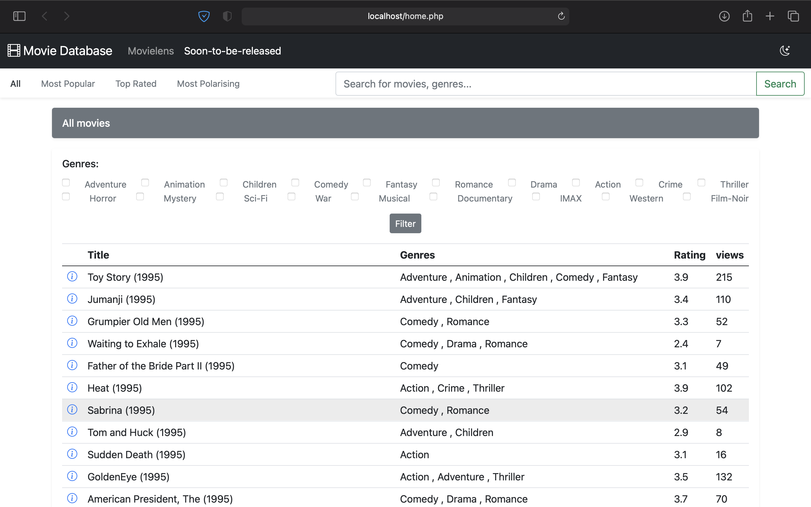
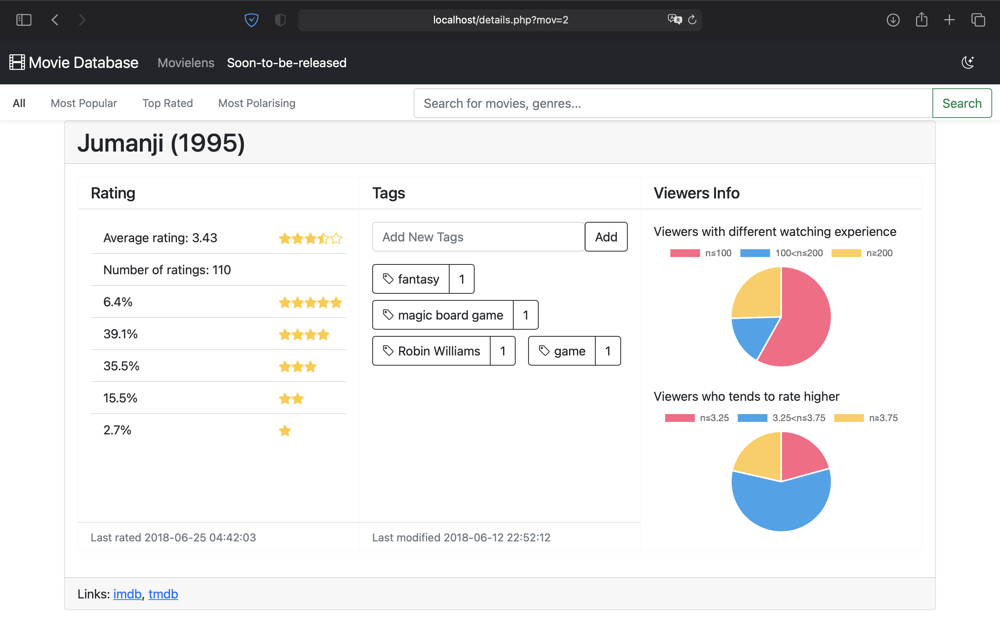
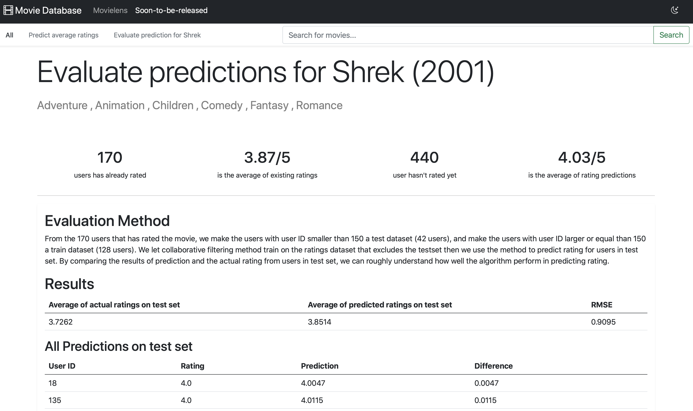
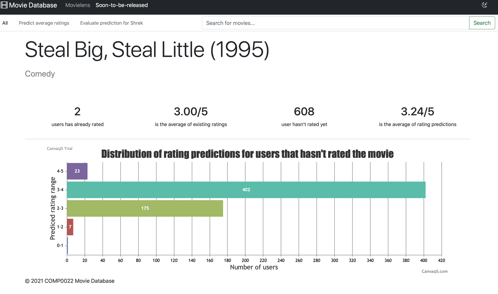

#  Movie Database

The Movie Database is a web application built on Bootstrap, jQuery and LAMP stack built with Docker Compose.









It makes use of the MovieLens data (http://files.grouplens.org/datasets/movielens/ml-latest-small.zip) which consists of information about movies and ratings and tags of movies provided by viewers, etc. The system is intended to enable marketing professionals to analyse how audiences have responded to films that have been released, and to help them understand the market for films that they are planning. It is intended to help them better understand the different kinds of viewers of movies and their varying preferences. The core functions that your system should provide are these:

Todos:

- [x] 1. Browsing films in the database (i.e., visual listings of films in the dataset, with user-modifiable views).
- [x] 2. Searching for a film to obtain a report on viewer reaction to it (i.e., an interpreted report with aggregate viewer ratings,
etc.).
- [x] 3. Reporting which are the most popular movies and which are the most polarising (extreme difference in ratings).
- [x] 4. Segmenting the audience for a released movie (i.e., identifying categories of viewer by the rating and tag data, also in
relation to data for ratings to all movies).
- [x] 5. Predicting the likely viewer ratings for a soon-to-be-released film based on the tags and or ratings for the film provided by
a preview panel of viewers drawn from the population of viewers in the database.

##  Installation and Configuration
 
* Clone this repository on your local computer
* configure .env as needed
* Run the `docker-compose up -d`.

```shell
git clone https://github.com/qianhaochen/movie-database
cd movie-database/
docker-compose up -d
```

Your LAMP stack is now ready!! You can access it via `http://localhost`.

### Configuration
This package comes with default configuration options. You can modify them by creating `.env` file in your root directory.

### Usage
Please check the detailed version of [how to use the LAMP stack built with Docker Compose](README-DOCKER-LAMP.md).

## Contributing
We are happy if you want to create a pull request or help people with their issues. If you want to create a PR, please remember that this stack is not built for production usage, and changes should good for general purpose and not overspecialised. 
Thank you! 
